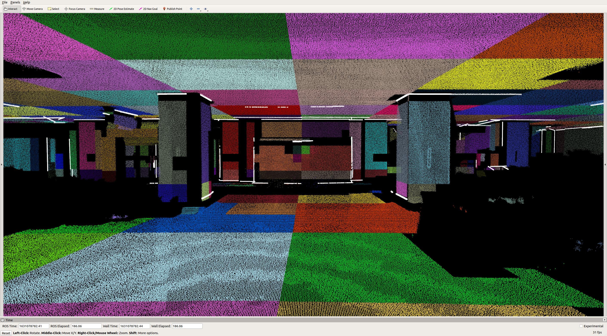

# Multiple LiDARs and Cameras Calibration
## Fast and Accurate Extrinsic Calibration for Multiple LiDARs and Cameras

The pre-print version of our paper is available [here](paper/paper.pdf). The code will be released at the end of this month (around October). Our experiment video is availalbe on [YouTube](https://youtu.be/PaiYgAXl9iY) and [Bilibili](https://www.bilibili.com/video/BV1p64y1h7ae?spm_id_from=333.999.0.0).

<!--  -->

## Introduction
In this paper, we propose a fast, accurate, and targetless extrinsic calibration method for multiple LiDARs and cameras based on adaptive voxelization. On the theory level, we incorporate the LiDAR extrinsic calibration with the bundle adjustment method. We derive the second-order derivatives of the cost function w.r.t. the extrinsic parameter to accelerate the optimization. On the implementation level, we apply the adaptive voxelization to dynamically segment the LiDAR point cloud into voxels with non-identical sizes, and reduce the computation time in the process of feature correspondence matching.

## Adaptive Voxelization
In both LiDAR-LiDAR and LiDAR-camera extrinsic calibration, we implement adaptive voxelization to accelerate the feature correspondence matching process. The point cloud map is dynamically segmented into voxels with non-identical sizes, such that only one plane feature is contained in each voxel. This process sufficiently saves the execution time of k-d tree searching from our previous [work1](https://ieeexplore.ieee.org/document/9361153) and [work2](https://ieeexplore.ieee.org/document/9495137?source=authoralert).

Fig.1 LiDAR-LiDAR adaptive voxelization.
Fig.2 LiDAR-camera adaptive voxelization.

## Dense Colorized Point Cloud Map